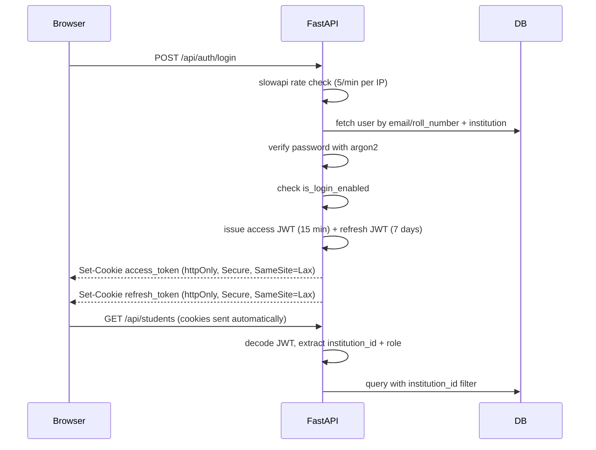

# Security Architecture

This document records the chosen security stack and policies. It extends [authentication.md](authentication.md) with concrete library choices and implementation rules.

**Status: implemented.** Auth, rate limiting, and tenant isolation are live in `backend/app/`.

## Technology Choices

| Concern | Library | Notes |
|---------|---------|-------|
| Password hashing | **argon2-cffi** (`PasswordHasher`) | OWASP-recommended; stronger than bcrypt for new projects |
| Auth tokens | **PyJWT** (HS256) | Signed JWTs in httpOnly cookies |
| Rate limiting | **slowapi** | Applied to all `/api/auth/*` endpoints |
| Password reset | Admin-initiated only (v1) | No self-service email flow in v1 |
| Email verification | Not in v1 | Admin creates all non-admin accounts |

## Authentication Flow



## Password Hashing

- Library: `argon2-cffi`
- Never store plain-text passwords
- Hash on account creation and credential reset
- Verify on login with `PasswordHasher.verify()`
- Rehash on login if argon2 parameters have been upgraded

```python
from app.core.security import hash_password, verify_password
password_hash = hash_password(plain_password)
verify_password(password_hash, plain_password)
```

## JWT Token Strategy

Tokens are stored in **httpOnly cookies**, not localStorage. This prevents XSS from stealing auth tokens.

### Access Token

| Property | Value |
|----------|-------|
| Cookie name | `access_token` |
| Lifetime | 15 minutes |
| Flags | `HttpOnly`, `Secure` (production), `SameSite=Lax` |
| Payload | `{ sub, role, institution_id, exp, iat }` |

### Refresh Token

| Property | Value |
|----------|-------|
| Cookie name | `refresh_token` |
| Lifetime | 7 days |
| Flags | `HttpOnly`, `Secure` (production), `SameSite=Lax` |
| Endpoint | `POST /api/auth/refresh` |

### Token Payload Rules

- `sub` — user UUID
- `role` — `admin`, `student`, `faculty`, or `parent`
- `institution_id` — tenant UUID; **always derived server-side at login, never from client input**
- Never include sensitive data (password hash, email) in the JWT payload

## Rate Limiting

Applied via **slowapi** on authentication endpoints:

| Endpoint | Limit | Reason |
|----------|-------|--------|
| `POST /api/auth/login` | 5 requests/minute/IP | Brute-force protection; admin accounts control entire tenant |
| `POST /api/auth/signup` | 3 requests/minute/IP | Prevent automated tenant creation |
| `POST /api/auth/refresh` | 10 requests/minute/IP | Normal refresh traffic |

Exceeded limits return `429 Too Many Requests` with `Retry-After` header.

## Password Reset (v1)

- **Admin-initiated only** — Institution Admin resets credentials for students, faculty, and parents via the user management UI
- No self-service "forgot password" email flow in v1
- Admin sets a new temporary password; user must change it on next login (future enhancement)
- Future v2: email-based reset flow with time-limited tokens

## Email Verification

Not in v1 scope. All non-admin accounts are created by the Institution Admin, who verifies identity out-of-band. Email verification may be added in a future version.

## Auth Endpoints

| Method | Path | Auth required | Rate limited |
|--------|------|--------------|-------------|
| POST | `/api/auth/signup` | No | Yes (3/min) |
| POST | `/api/auth/login` | No | Yes (5/min) |
| POST | `/api/auth/logout` | Yes | No |
| POST | `/api/auth/refresh` | Refresh cookie | Yes (10/min) |
| GET | `/api/auth/me` | Yes | No |

## Security Rules (mandatory)

1. Never trust `institution_id` or `role` from the client request body or query params
2. Always derive tenant and role from the decoded JWT
3. Disabled users (`is_login_enabled = false`) must receive `401 Unauthorized` on login
4. All database queries must filter by `institution_id` from the JWT
5. JWT secret (`SECRET_KEY`) must be a strong random value in production; never commit to version control
6. Use `Secure` cookie flag in production (HTTPS only)
7. Log failed login attempts with IP address (no password in logs)

## Related Documentation

- [Authentication](authentication.md)
- [Authorization](authorization.md)
- [Multi-Tenancy](multi-tenancy.md)
- [Frontend Stack](frontend-stack.md)
- [API Conventions](api-conventions.md)
